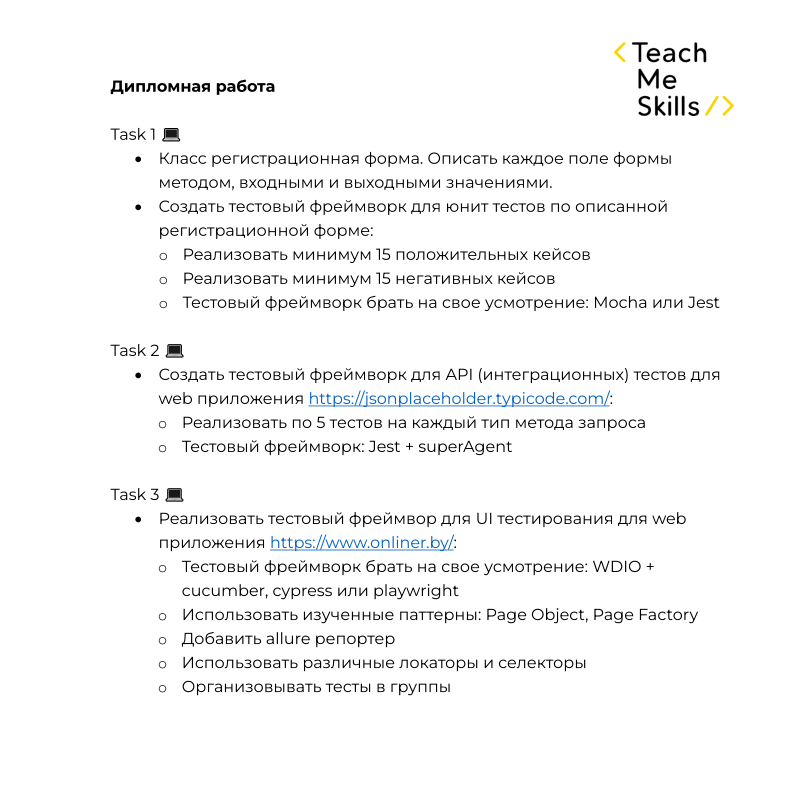
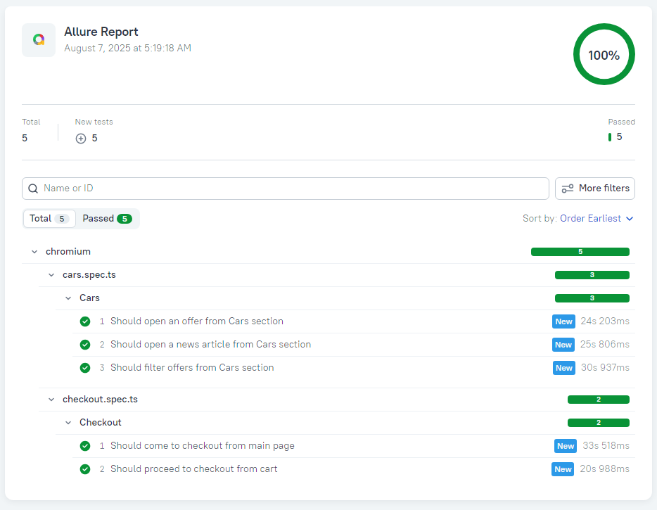

# 🎓 Дипломный проект по автоматизации тестирования

## 📌 Задание



---

## 📌 Содержание

- [📋 Чек-лист тестов](#cases)
- [🛠️ Стек технологий](#stack)
- [⚙️ Подготовка к запуску](#setup)
- [🚀 Запуск автотестов](#autotests)
- [📊 Генерация Allure-отчетов](#generateAllureReport)
- [📑 Пример Allure-отчета](#allureReport)
- [👤 Автор](#author)

---

<a id="cases"></a>

## 📋 Чек-лист автоматизированных тестов

## 🖥️ Unit Tests

### ❌ Negative Tests

- ✔️ Should show error in case of registrating without email
- ✔️ Should show error in case of registrating without password
- ✔️ Should show error in case of registrating without email and password
- ✔️ Should show error in case of registrating with password without password confirmation
- ✔️ Should show error in case of registrating with password and password confirmation that do not match
- ✔️ Should show error if password has less than 8 symbols
- ✔️ Should show error if password doesn't have a number
- ✔️ Should show error if password doesn't have a lowercase letter
- ✔️ Should show error if password doesn't have an uppercase letter
- ✔️ Should register user with password that contains symbols: `~\! @#$%^&*()_-+={[}]|:;"'<,>.?`
- ✔️ Should show error in case of email with more than one '@'
- ✔️ Should show error in case of email which ends with '.'
- ✔️ Should show error in case of email with consecutive '.' after '@'
- ✔️ Should show error in case of email without '@'
- ✔️ Should show error in case of email without username before '@'

### ✅ Positive Tests

- ✔️ Should create registrationForm object with valid input
- ✔️ Should create registrationForm object with empty input
- ✔️ Should register user with valid input with all fields filled
- ✔️ Should register user with valid input without First Name
- ✔️ Should register user with valid input without Second Name
- ✔️ Should register user with valid input without Phone Number
- ✔️ Should register user with valid input without First Name, Second Name and Phone Number
- ✔️ Should change First Name
- ✔️ Should change Second Name
- ✔️ Should change email
- ✔️ Should change password
- ✔️ Should change Phone Number
- ✔️ Should delete registration form data
- ✔️ Should deactivate user
- ✔️ Should activate user

## 🖥️ API Tests

### POST Method Tests

- ✔️ Should return status 201
- ✔️ Should create resource with id that has number value
- ✔️ Should create resource with data corresponding to request
- ✔️ Should create resource with id only if request body contains unexpected property
- ✔️ Should create resource with id and userId only

### DELETE Method Tests

- ✔️ Should return status 200
- ✔️ Should delete resource #1
- ✔️ Should delete resource #2
- ✔️ Should delete resource #3
- ✔️ Should delete resource #4

### PUT Method Tests

- ✔️ Should return status 200
- ✔️ Should update resource with data from object 1
- ✔️ Should update resource with data from object 2
- ✔️ Should update resource with data from object 3
- ✔️ Should leave only id if update resource with unexpected properties

### PATCH Method Tests

- ✔️ Should return status 200
- ✔️ Should update id with valid number value
- ✔️ Should update title with valid string value
- ✔️ Should update body property with valid string value
- ✔️ Should update userId with valid number value
- ✔️ Should leave resource without changes if patch with empty body

### GET Method Tests

- ✔️ Should return status 200
- ✔️ Should receive id with valid number value
- ✔️ Should receive title with valid string value
- ✔️ Should receive body property with valid string value
- ✔️ Should receive userId with valid number value

## 🖥️ UI Tests

### Cars Section

- ✔️ Should open an offer from Cars section
- ✔️ Should open a news article from Cars section
- ✔️ Should filter offers from Cars section

### Checkout Section

- ✔️ Should come to checkout from main page
- ✔️ Should proceed to checkout from cart

---

<a id="stack"></a>

## 🛠️ Стек технологий

- [Mocha + Chai]() – фреймворк для Unit тестирования
- [Jest + superagent]() – фреймворк для тестирования API
- [Playwright](https://playwright.dev/) – фреймворк для тестирования UI
- [Node.js](https://nodejs.org/) – среда выполнения JavaScript
- [Allure Report](https://docs.qameta.io/allure/) – система отчетности
- [npm](https://www.npmjs.com/) – менеджер пакетов

---

<a id="setup"></a>

## ⚙️ Подготовка к запуску

1️⃣ Установить Node.js (версия 22+) с [официального сайта](https://nodejs.org/)  
2️⃣ Склонировать проект  
3️⃣ Локально установить все необходимые пакеты через команду npm ci

---

<a id="autotests"></a>

## 🚀 Запуск автотестов

Запуск UI тестов

```bash
npm run uiTest
```

Запуск API тестов

```bash
npm run apiTest
```

Запуск Unit тестов

```bash
npm run unitTest
```

---

<a id="generateAllureReport"></a>

## 📊 Генерация и открытие Allure отчетов

```bash
npm run generateAllureReport
npm run openAllureRepot
```

---

<a id="allureReport"></a>

## 📑 Пример Allure отчета



---

<a id="author"></a>

## 👤 Автор

Alexey06by
